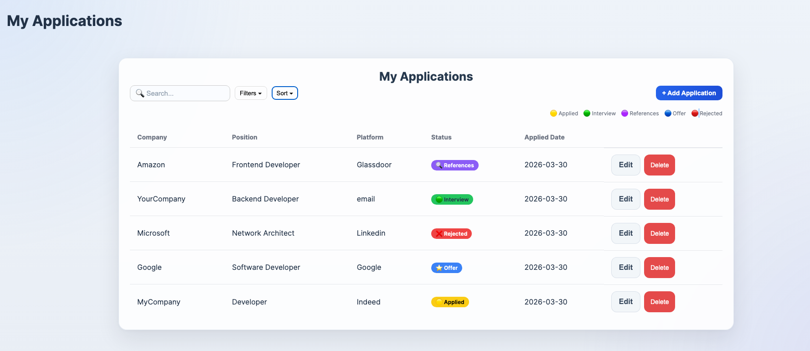
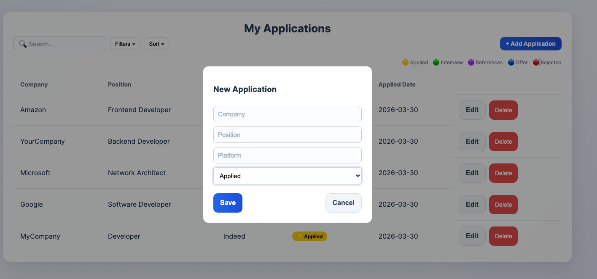
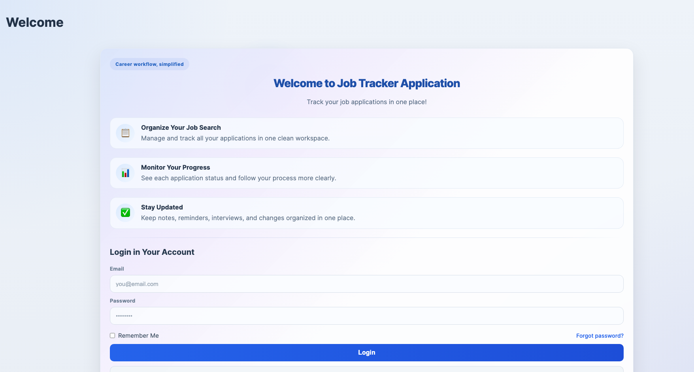

# 🚀 Job Application Tracker (Frontend)

A modern and intuitive web application to help you track your job applications in one place.

Built with a clean UI and focused on productivity, this app allows you to organize, monitor, and manage your job search efficiently.

---

## ✨ Features

- 📌 Add and manage job applications
- 🔍 Search, filter, and sort applications
- 📊 Track application status:
  - Applied
  - Interview
  - References
  - Offer
  - Rejected
- 🧾 Clean dashboard with real-time updates
- 🎯 Simple and distraction-free UI
- ⚡ Fast and responsive design

---

## 🖼️ Screenshots

### 📊 Dashboard


### ➕ New Application Modal


### 🔐 Login Page


---

## 🧠 Why this project?

Tracking job applications across multiple platforms can quickly become overwhelming.

This project was built to:

- Centralize job tracking
- Improve organization during job search
- Provide a clear visual pipeline of applications
- Simulate a real-world fullstack product

---

## 🛠️ Tech Stack

- **Frontend:** React + TypeScript
- **Styling:** CSS / Tailwind (if applicable)
- **State Management:** (add if you used: Context, Redux, etc.)
- **Backend API:** Node.js + Express (seu outro repo)
- **Database:** MySQL

---

## 🔗 Related Repositories

- 🔙 Backend API  
  👉 https://github.com/Marcelofcdantas/Job-Application-Tracker-API

---

## 🚀 Getting Started

### 1. Clone the repository

```bash
git clone https://github.com/Marcelofcdantas/Job-Application-Tracker-Frontend
cd Job-Application-Tracker-Frontend
```

### 2. Install dependencies
```bash
npm install
```
### 3. Run the project
```bash
npm install
```
The app will be available at:
```bash
http://localhost:5173
```
### ⚙️ Environment Variables

Create a .env file:
```bash
VITE_API_URL=http://localhost:3000
```
📌 Future Improvements
- 🔐 Authentication with JWT
- 📱 Mobile responsiveness improvements
- 📊 Analytics dashboard
- 🔔 Notifications / reminders
- 🌐 Social login (Google)

👨‍💻 Author

Marcelo Dantas

- 💼 Fullstack Developer
- 🔐 Background in Security & Systems

⭐ Show your support

If you liked this project:

- ⭐ Star the repo
- 🍴 Fork it
- 🧠 Use it in your job hunt

📄 License

This project is open source and available under the MIT License.
